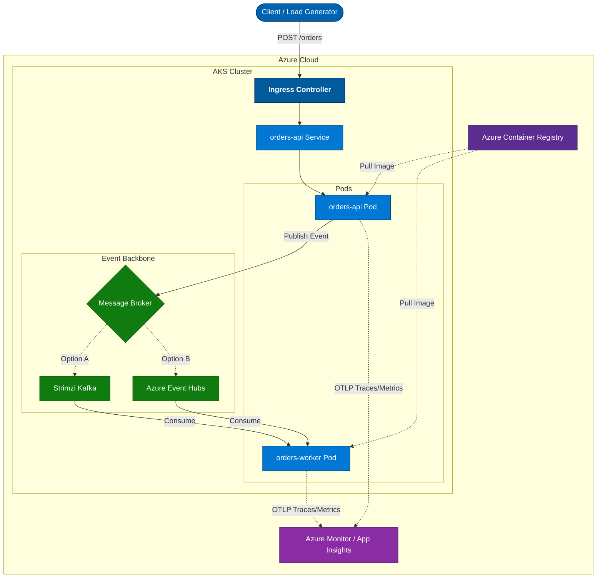

# Orders Demo — Event-Driven Microservices on AKS
### AKS · Event Hubs · Kafka · KEDA · GitHub Actions · GitHub Copilot

This repository contains a complete, end-to-end demonstration of building, deploying, and scaling cloud-native microservices on Azure Kubernetes Service (AKS). The project showcases how GitHub Copilot, Azure Event Hubs, Kafka, KEDA, and GitHub Actions come together to deliver a modern, scalable, event-driven architecture.

## Overview

The demo consists of two microservices:

| Service | Description | Tech Highlights |
|---------|-------------|------------------|
| orders-api | Receives incoming order requests and publishes them to a messaging backend (Event Hubs or Kafka) | FastAPI, Gunicorn, Kafka client, Azure Event Hub SDK |
| orders-worker | Consumes and processes order events; horizontally autoscaled via KEDA based on backlog | Python worker, EventHub/Kafka consumers, KEDA autoscaler |

## Architecture



Legend:
- **Blue (control/workloads)** — AKS ingress + services handling HTTP traffic.
- **Green (broker)** — Messaging backbones (Strimzi Kafka, Azure Event Hubs).
- **Purple (registry/observability)** — ACR and Azure Monitor/App Insights integrations.
- **Solid arrows** — Primary request/publish/consume paths.
- **Dashed arrows** — Optional or alternative flows (Kafka vs. Event Hub) and image pulls.
- **Dotted arrows** — Telemetry exports (OTLP traces/metrics) heading to Azure Monitor.

```
Client
    ↓ POST /orders
orders-api (FastAPI)
    ↓ publish
Event Hub / Kafka
    ↓ consume
orders-worker (Python worker)
    ↓
Processing, metrics, logs
```

## 🎯 Skills Demonstrated
* Code generation from PRDs
* Scaffolding FastAPI apps
* Creating Dockerfiles & Helm charts
* Accelerating Kubernetes configuration
2. Event-Driven Architecture
* Producers and consumers
* Kafka and Event Hub dual-mode backend
* Consumer groups and checkpointing
* Message publication and processing patterns
3. Kubernetes on Azure
* Deploying microservices with Helm
* Configuring Deployments, Services, and Ingress
* Using Managed Identities with AKS
* Integrating with ACR
4. Autoscaling with KEDA
* Event-Hub-backlog-based autoscaling
* Scale from 0 → N worker replicas
* Real-time processing demos
5. Observability with OpenTelemetry
* Instrument FastAPI + worker services for traces and metrics
* Export telemetry via OTLP to Azure Monitor / Grafana dashboards
* Correlate KEDA scaling decisions with application signals
6. CI/CD with GitHub Actions
* Build → Scan → Push → Deploy
* ACR authentication
* Automatic Helm releases
* Environment separation
7. Infrastructure as Code (Bicep)
* AKS cluster
* Event Hub namespace + Event Hub
* Storage account for checkpoints
* ACR + Managed Identities + RBAC
* Modularized Bicep design
8. (Optional) Multi-Cluster with AKS Fleet Manager
* Workload propagation
* Multi-region deployments
* Shared Event Hub backbone
* Cluster-aware autoscaling
---
## 📚 Repository Structure
```
orders-demo/
│
├── docs/
│   ├── orders-api-prd.md
│   └── orders-worker-prd.md
│
├── infra/
│   ├── main.bicep
│   └── modules/
│       ├── acr.bicep
│       ├── aks.bicep
│       ├── eventhubs.bicep
│       ├── storage.bicep
│       ├── identity.bicep
│       └── roles.bicep
│
├── services/
│   ├── orders-api/
│   │   ├── app/
│   │   ├── Dockerfile
│   │   └── requirements.txt
│   └── orders-worker/
│       ├── app/
│       ├── Dockerfile
│       └── requirements.txt
│
├── charts/
│   ├── orders-api/
│   └── orders-worker/
│
└── .github/
    └── workflows/
        ├── build-api.yml
        ├── build-worker.yml
        └── deploy.yml
```

## 🌐 Environment & Prerequisites
### Azure Resources the Demo Uses
|Resource	| Purpose|
| ----------- | ----------- |
|AKS	| Runs the microservices |
|ACR	| Stores Docker images |
|Event Hubs	| Messaging backend (phase 2) |
|Kafka (Strimzi)	| Primary in-cluster Kafka (phase 1) |
|Storage Account	| Event Hub checkpointing |
|Managed Identity	| Secure broker access |
|KEDA	| Event-driven autoscaling |
|Azure Monitor + Application Insights| Collects OpenTelemetry traces/metrics/logs via OTLP ingestion |

> Storage accounts are globally unique. By default the Bicep template now appends a deterministic suffix to the `storageAccountPrefix` value (see `infra/parameters.dev.json`) so every environment gets its own valid name. Set `storageAccountRandomize` to `false` and provide `storageAccountName` if you need to pin a specific name.

### Choosing Regions & AKS Versions
- Update `infra/parameters.<env>.json` and/or export `DEPLOYMENT_LOCATION` before running `make infra-deploy` so resources land in the region you intend to demo from.
- AKS only supports a subset of Kubernetes versions per region. Always verify the available versions before deploying:
    ```bash
    az aks get-versions --location <region> --output table
    ```
    Copy a non-preview version (for example `1.33.5` in `northcentralus`) into the `kubernetesVersion` parameter if the default is not available.
- If you switch regions later, rerun the command above for the new region and update the parameter or pass `-p kubernetesVersion=<version>` when invoking `az deployment`/`make infra-deploy`.

All resources are provisioned using the Bicep files under /infra.

**Tools Required**
* Azure CLI
* kubectl
* Helm
* Docker
* [act](https://github.com/nektos/act) (for local GitHub Actions runs)
* GitHub CLI (optional)
* VS Code + GitHub Copilot

## 📺 Livestream / YouTube Series Curriculum

This repository is designed to accompany a multi-part technical series.

### Session 1 — Architecture + Environment Build + Repo Bootstrap
* Overview of event-driven architecture
* Deploy AKS + Storage + MI + Application Insights/Log Analytics workspace using Bicep
* Repo structure & PRDs

### Session 2 — Build orders-api with GitHub Copilot
* FastAPI + event producer
* Dual-mode backend support
* Local testing
* Add OpenTelemetry tracing + metrics exporters for the API wired to Azure Monitor/Application Insights
* Demonstrate Makefile lint/build targets and local `act` workflow run

### Session 3 — Build orders-worker with GitHub Copilot
* Event consumer loop
* Checkpointing & metrics
* Test against Kafka
* Wire worker logs/metrics into OpenTelemetry + Azure Monitor/Grafana dashboards

### Session 4 — Containerization + Helm Charts
* Dockerfiles
* Deploy both services to AKS with Helm
* Configure OTLP exporter endpoints (Application Insights ingestion + optional self-hosted collector) via Helm values

### Session 5 — CI/CD with GitHub Actions
* Build pipelines
* Deploy pipelines
* ACR integration
* Validate Azure Monitor / Application Insights connectivity as part of smoke tests
* Show how to run workflows locally with `make ci-local` (act)

### Session 6 — Event Hub Integration + KEDA Autoscaling
* Add Event Hub integration to orders-api and order-worker
* Deploy Event Hub
* Event Hub consumer group
* KEDA ScaledObject
* Live autoscale demo
* Trace end-to-end flow across Kafka/Event Hub + worker using Azure Monitor + Grafana dashboards

### Session 7 (Optional) — AKS Fleet Manager
* Multi-cluster deployment
* Shared Event Hub backbone
* Global autoscaling

## 🧪 Running the Demo
1. Deploy the infrastructure (using the provided dev parameters file)
```
az deployment sub create \
  --name orders-demo \
  --location <region> \
  --template-file infra/main.bicep \
   --parameters @infra/parameters.dev.json
```
    _Shortcut_: Run `make infra-deploy` from `orders-demo/` to execute the same deployment and capture its outputs under `deploy/generated/infra-outputs.json`.
    - `make infra-deploy` now looks for an SSH public key at `~/.ssh/id_rsa.pub`. Override this path with `SSH_PUBLIC_KEY_PATH=~/.ssh/orders-demo.pub make infra-deploy` or create a key with `ssh-keygen -t rsa -b 4096 -f ~/.ssh/orders-demo`.
    - One-time setup: ensure your subscription is registered for the monitoring providers AKS relies on:
      ```
      az provider register --namespace Microsoft.OperationsManagement --wait
      az provider register --namespace Microsoft.OperationalInsights --wait
      ```
2. Get AKS credentials
```
az aks get-credentials \
  -g <resource-group> \
  -n <aks-name>
```
3. Convert the captured outputs into Helm overrides
```
make helm-values
```
    This creates `deploy/generated/orders-api.values.generated.yaml` and `deploy/generated/orders-worker.values.generated.yaml`, pre-populated with the actual Event Hub namespace, storage account, and Application Insights connection string from Azure.
4. Deploy the services with Helm (the `make deploy` target chains docker builds → `helm-values` → Helm releases)
```
make deploy
```
4. Generate load
```
hey -z 30s -q 10 https://<api-endpoint>/orders
```

Watch KEDA scale out:
```
kubectl get pods -w
```

## 🙋 Contributing

Contributions are welcome!
Feel free to:
* File issues
* Submit PRs
* Suggest improvements or new demo scenarios

## 📄 License

This project is licensed under the [Apache License 2.0](LICENSE).

⭐ Acknowledgements

This project highlights Azure + GitHub working together across:
* Developer productivity
* DevOps automation
* Kubernetes operations
* Cloud-native architectures
* Event-driven scaling

Thanks to all participants in building and reviewing this demo!
